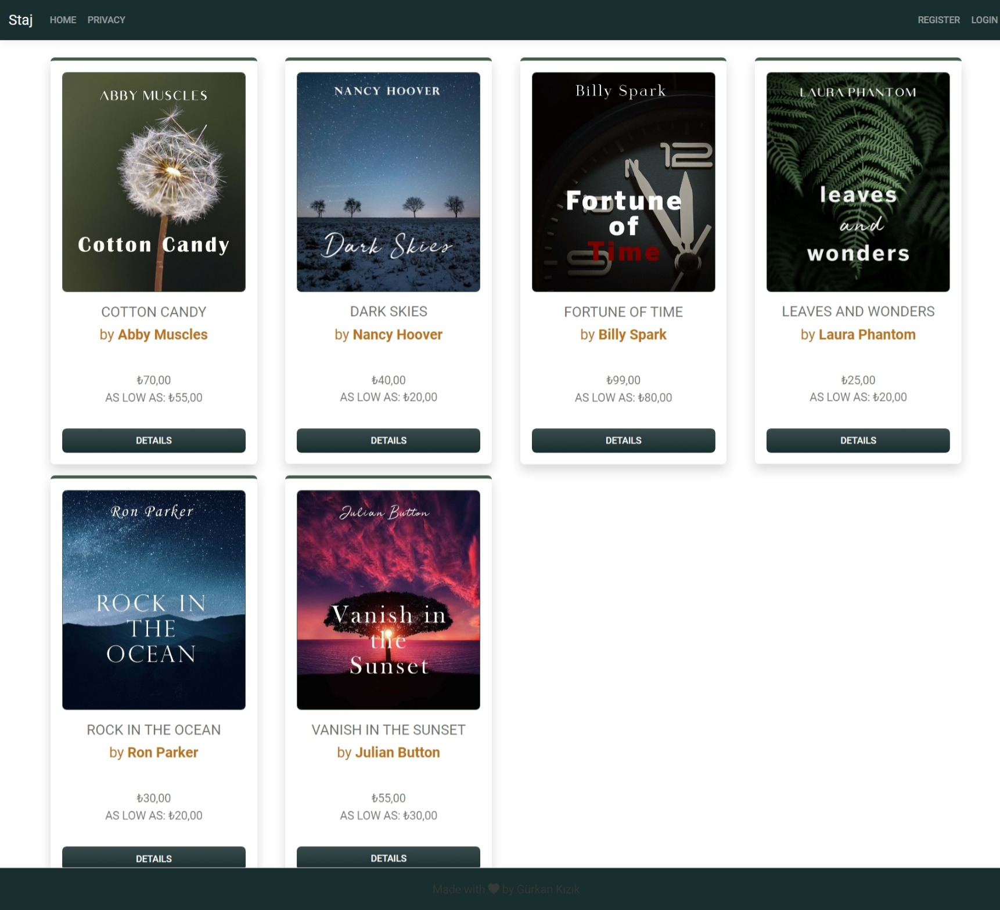
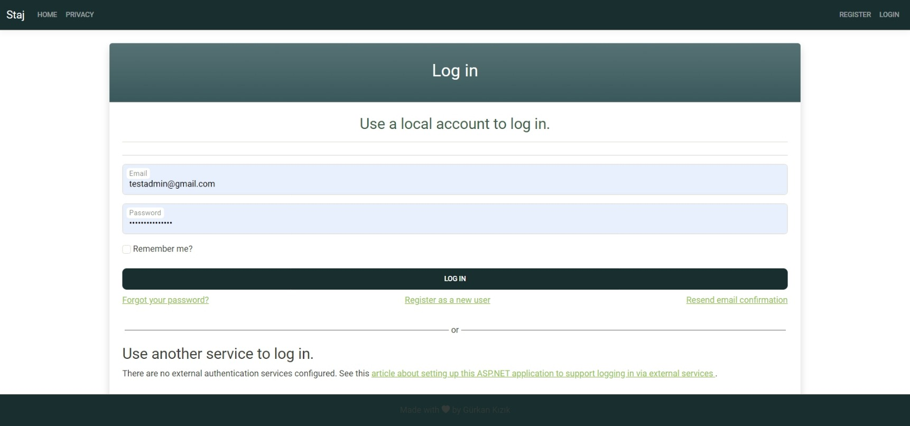
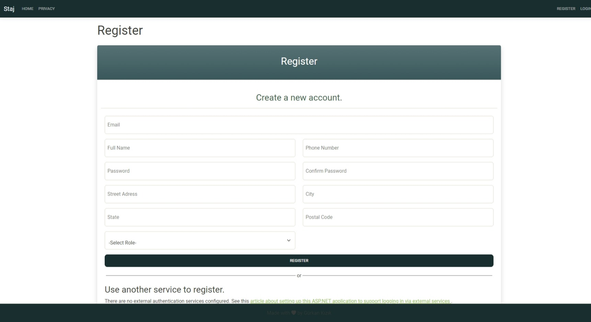
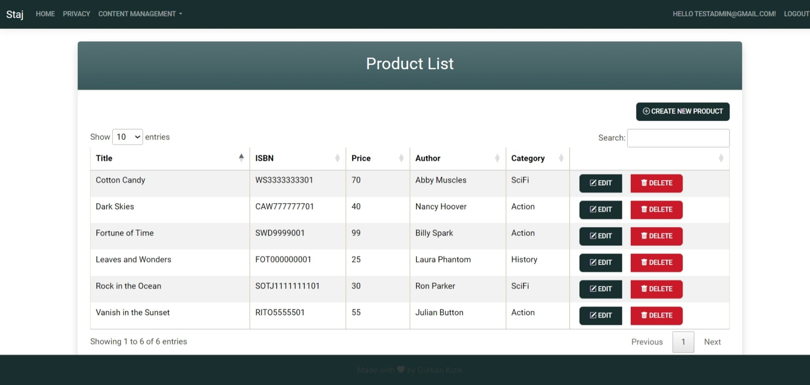
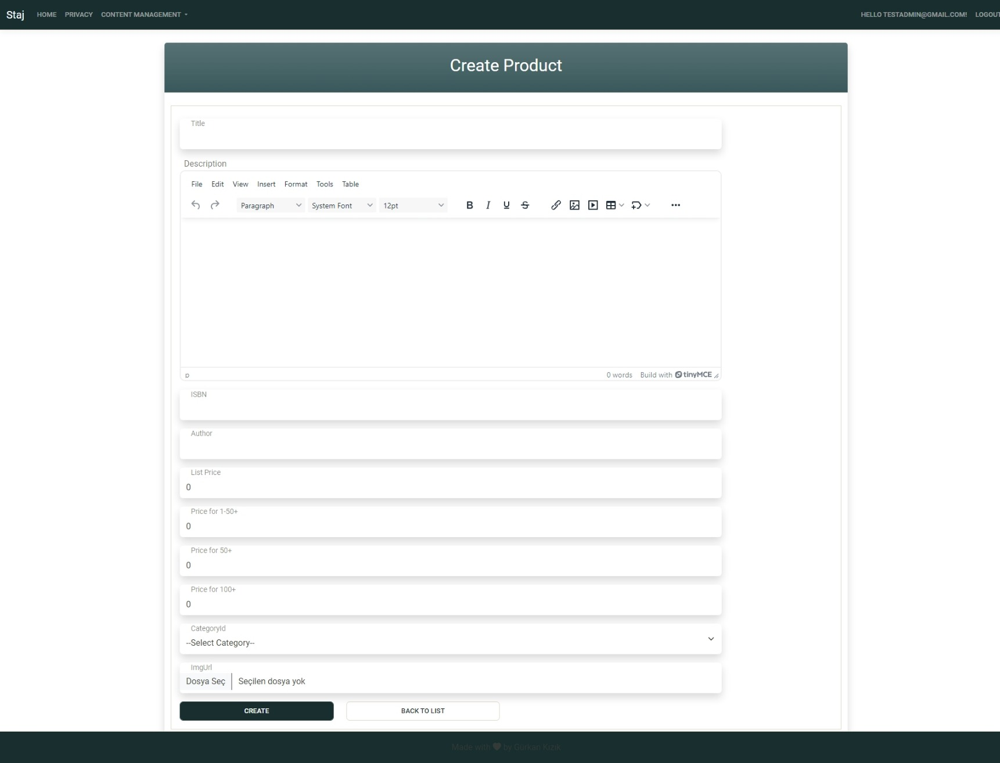
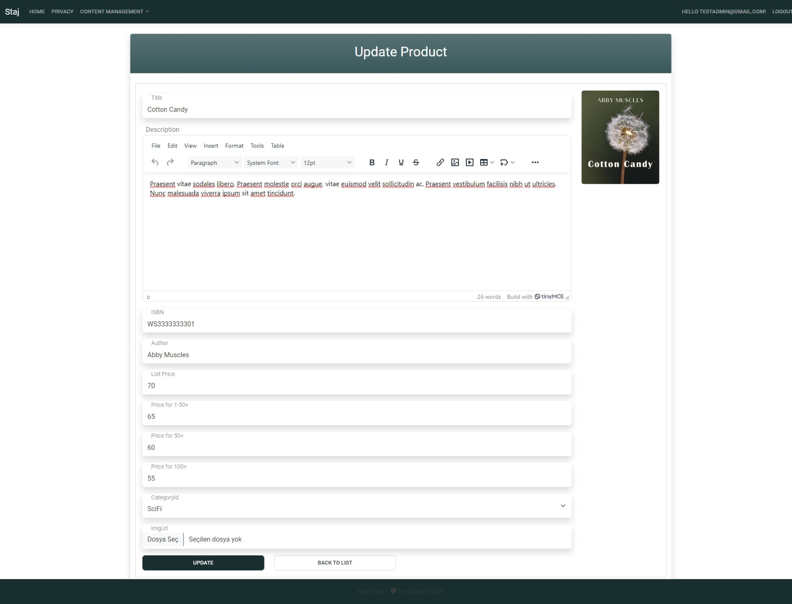
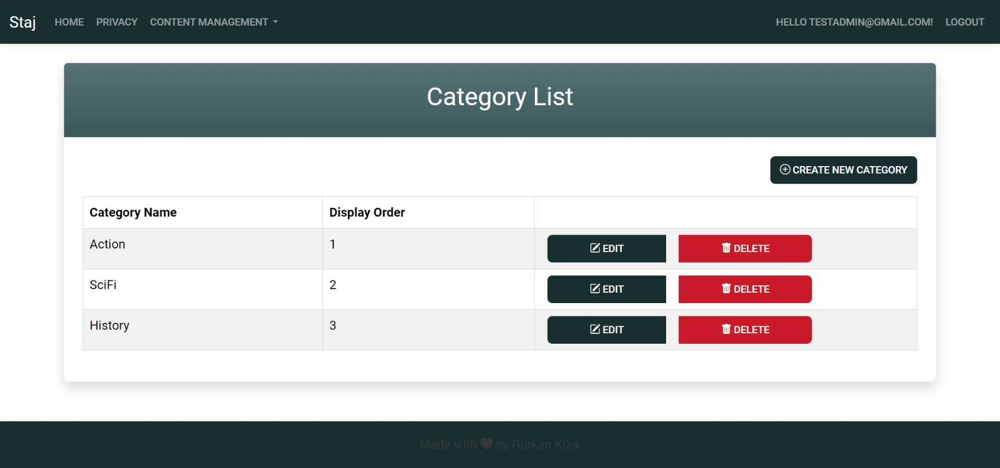
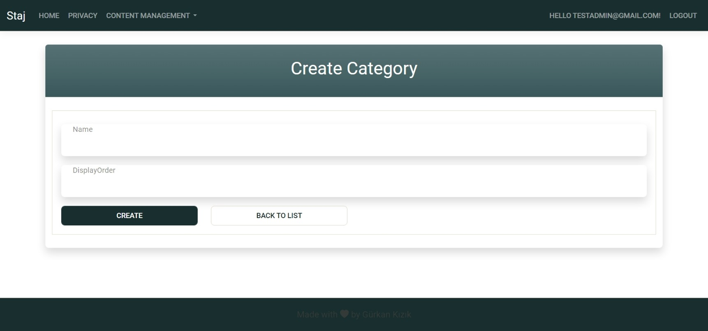
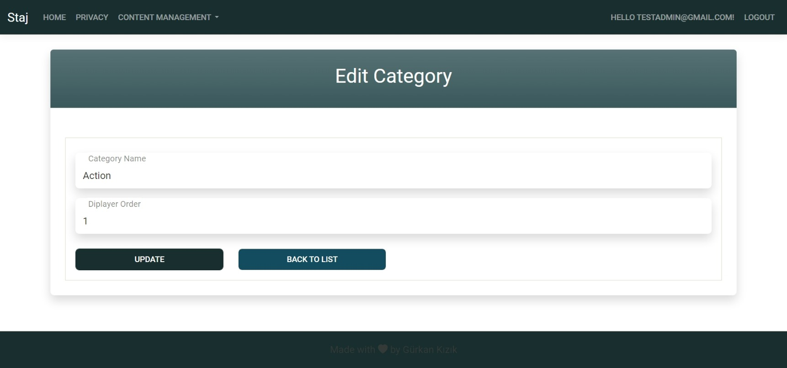

# Book Store Project

## Project Description

The Book Store project is a web application designed to manage products and categories. It provides an admin interface for getting, creating, updating, and deleting products and categories. The project is built using ASP.NET Core and follows a layered architecture with a focus on clean code and maintainability.

## Technologies Used

- **ASP.NET Core 8.0**: The main framework for building the web application.
- **Entity Framework Core**: For database interactions and ORM.
- **AutoMapper**: For object-to-object mapping.
- **FluentValidation**: For validating data transfer objects (DTOs).
- **Newtonsoft.Json**: For JSON serialization and deserialization.
- **Microsoft.AspNetCore.Mvc**: For building the API controllers.
- **Microsoft.AspNetCore.Authorization**: For handling authorization.
- **Microsoft.AspNetCore.Identity**: For user authentication and management.
- **Bootstrap**: For responsive UI design.
- **jQuery**: For client-side scripting.
- **SQL Server**: The database used for storing application data.

## Project Structure

The project is divided into several layers:

- **StajWeb.Models**: Contains the domain models and DTOs.
- **StajWeb.DataAccess**: Contains the repository pattern implementation and database context.
- **StajWeb.Utility**: Contains utility classes and constants.
- **StajWeb**: The main web application project.
- **Staj.Api**: The API project for handling HTTP requests.

## API Endpoints

### Categories

- **GET** `/api/Category`: Get all categories.
- **GET** `/api/Category/{id}`: Get a category by ID.
- **POST** `/api/Category`: Create a new category.
- **PUT** `/api/Category/{id}`: Update an existing category.
- **DELETE** `/api/Category/{id}`: Delete a category.

### Products

- **GET** `/api/Product`: Get all products.
- **GET** `/api/Product/{id}`: Get a product by ID.
- **POST** `/api/Product`: Create a new product.
- **PUT** `/api/Product/{id}`: Update an existing product.
- **DELETE** `/api/Product/{id}`: Delete a product.

## Screenshots

### Home Page

### Log In Page

### Register Page

### Products Page

### Create Product Page

### Update Product Page

### Category List

### Create Category Page

### Edit Category Page
